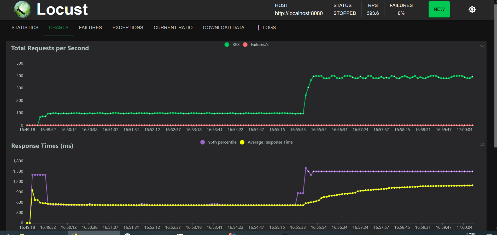
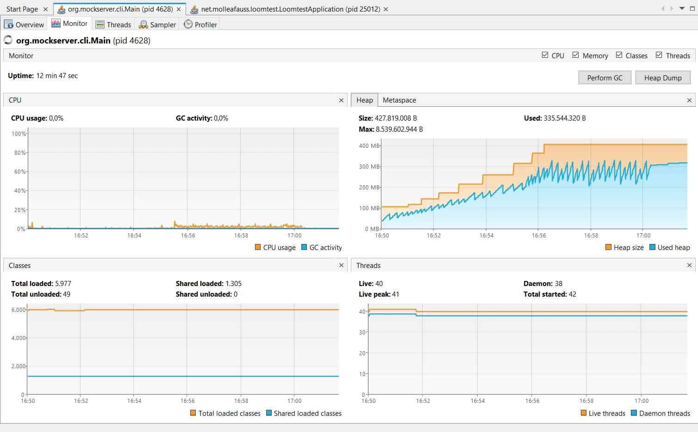
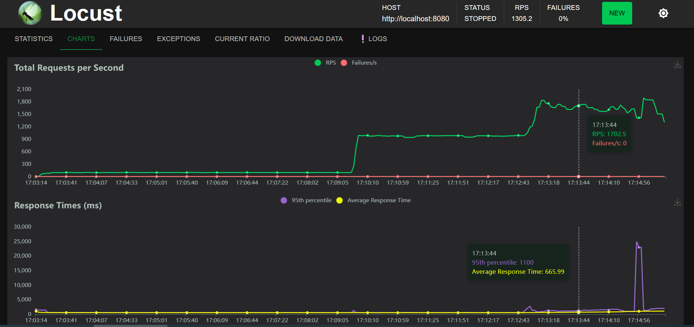
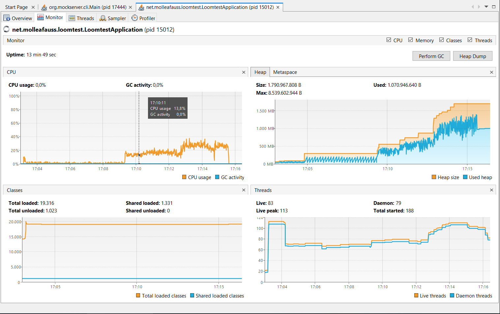
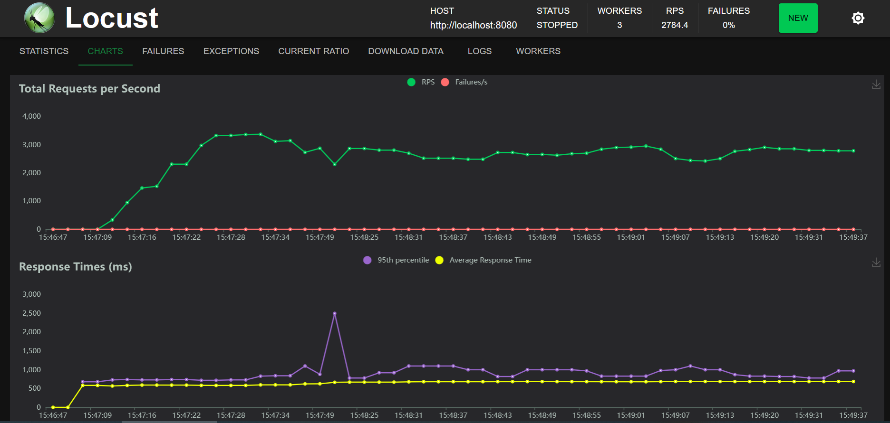
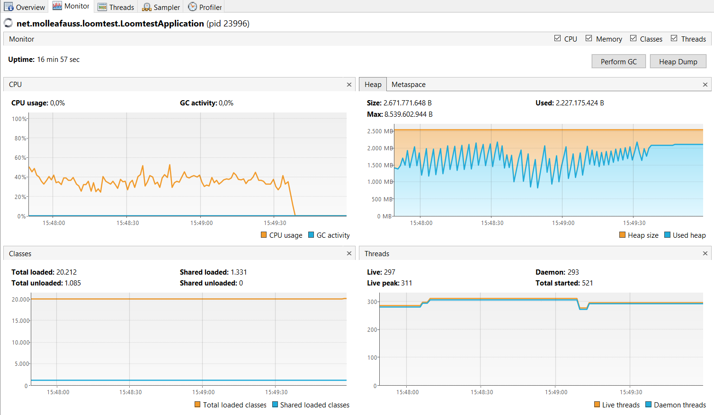

## RESULTS

The following results were captured on the following laptop (Lenovo Legion C7 - 2021)

```
Operating System: Windows 10 22H2
Processor: Intel(R) Core(TM) i7-10875H CPU @ 2.30GHz   2.30 GHz
RAM: 32GB
 
Database: MariaDB 10.6.4 running locally (not dockerized)
```

Graphs of the application(s) performance was captured using [VisualVM](https://visualvm.github.io/)

### USING NATIVE THREADS
The following images shows how the system performs using native threads. Load started with 50 concurrent users
and then increased to 500 concurrent users.
As expected, with the [default of 200 threads](https://docs.spring.io/spring-boot/docs/current/reference/html/application-properties.html#application-properties.server.server.tomcat.threads.max) 
used by spring+tomcat - the average RPS starts degrading when the load is increased to 500 concurrent users, 
as tomcat will is not have enough threads to serve all requests concurrently, thus starts queueing, causing the 
average time to serve requests to drift upwards (with the 99% around 1500ms response time).

The application GC looks stable - it of course becomes more active once more traffic comes in. Mockserver is using
netty and a reactive model, resulting in only 40 threads used; the memory in the mockserver grows as it's recording
the requests.

**RPS and response times from locust**


**Application status from VisualVM**


**MockServer status from VisualVM**



### USING VIRTUAL THREADS
Switching the config of `spring.threads.virtual.enabled` to true, and rerunning the test, we got the below results.
Load started with 50 concurrent users then increased to 500 concurrent users. and then to 2500.

In this case, the load at 500 concurrent user stabilised around 1000 RPS (considering that the external system added
500ms on every request, each user could get ~2 requests each second), but when the load increased to 2500 a breakdown
occurred - and it was in Locust. Locust is using python and was running single-threaded, so it reached saturation.

No matter what, the application memory and GC seemed stable, although the CPU was way higher (~20% vs ~5% during the 500
concurrent user - the fact that each request is not isolated in its own thread may require more work from the GC to 
determine which objects were to be garbage collected).

Mockserver status was similar to the native threads case, although with more memory used due to the higher number of 
requests recorded.

**RPS and response times from locust**


**Application status from VisualVM**


**MockServer status from VisualVM**


A second run using multiple locust workers (3) and 2000 concurrent users gave better results - although there was still
CPU saturation in locust. It peaked ~2700rps (double than previous) and the average response was still 500ms with 95%
that was occasionally moving up towards 1000ms.

Application CPU in this case was over 40% and also native threads peaked to a maximum. 

**RPS and response times from locust**


**Application status from VisualVM**



